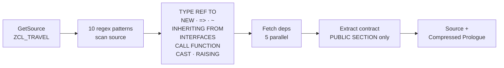
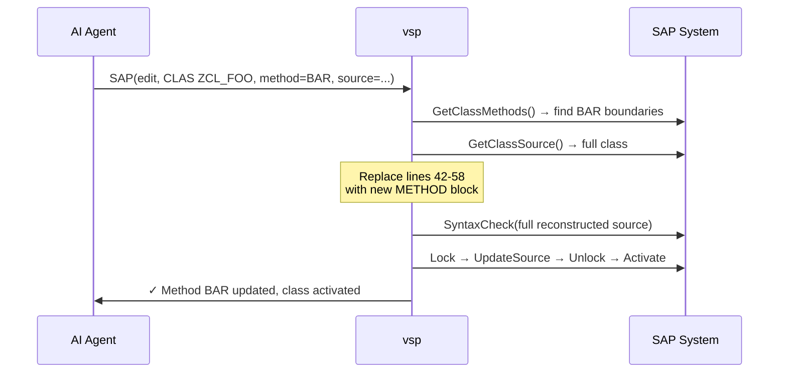
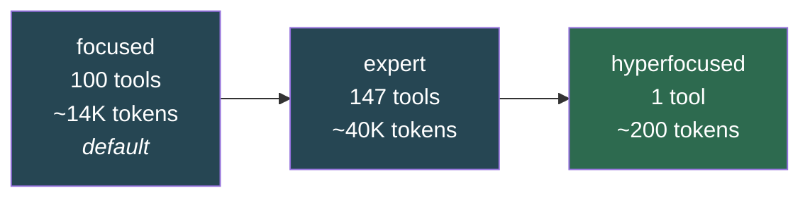

# Vibing Steampunk (vsp)

**AI-Agentic Development Unlocked for ABAP** — ECC, S/4HANA, everywhere ADT is available.

> **ADT ↔ MCP Bridge**: Gives Claude (and other AI assistants) full access to SAP ADT APIs.
> Read code, write code, debug, deploy, run tests — all through natural language (or DSL for automation).
>
> See also: [OData ↔ MCP Bridge](https://github.com/oisee/odata_mcp_go) for SAP data access.
>
> **Want to review or test?** Start here: **[Reviewer Guide](docs/reviewer-guide.md)** — 8 hands-on tasks, no SAP needed.


## 100 Stars!

Read the milestone article: **[Agentic ABAP at 100 Stars: The Numbers, The Community, and What's Cooking](articles/2026-02-18-100-stars-celebration.md)**

## What's New — Token Efficiency Sprint

> **Sprint goal:** make every token count. Built-in ABAP understanding, compressed dependency context, and a single-tool mode that opens the door for local/small models.

The full version history is in [CHANGELOG.md](CHANGELOG.md).

### Hyperfocused Mode — 1 Tool to Rule Them All

Single `SAP(action, target, params)` tool replaces up to 129 individual tool definitions.

```
SAP(action="read",   target="CLAS ZCL_TRAVEL")
SAP(action="edit",   target="CLAS ZCL_TRAVEL", params={"source": "..."})
SAP(action="create", target="DEVC", params={"name": "$ZOZIK", "description": "New pkg"})
SAP(action="help",   target="debug")
```

| Metric | Focused (100 tools) | Expert (147 tools) | Hyperfocused (1 tool) |
|--------|-------------------:|-------------------:|----------------------:|
| MCP schema tokens | ~14,000 | ~40,000 | **~200** |
| Reduction | — | — | **99.5%** |

All safety controls (`--read-only`, `--allowed-ops`, `--allowed-packages`) work identically — the universal tool routes through the same handler → ADT client → `checkSafety()` chain.

> *Thanks to [Filipp Gnilyak](https://github.com/nickel-f) for the hyperfocused mode concept.*

### Context Compression — Built-in ABAP Understanding

`GetSource` auto-appends a **compressed dependency prologue** — public API signatures of every referenced class, interface, and FM. One MCP call = source + full surrounding context.

**How it works:**



**Compression by object type:**

| What | Keeps | Strips | Typical ratio |
|------|-------|--------|:-------------:|
| **Class** | `CLASS DEFINITION` + `PUBLIC SECTION` | Protected, Private, Implementation | **7–30x** |
| **Interface** | Full `INTERFACE...ENDINTERFACE` | — | 1x (already compact) |
| **Function Module** | `FUNCTION` line + `*"` signature block | Body | **5–15x** |

**Real-world example** — `ZCL_ABAPGIT_ADT_LINK` (abapGit codebase):
- 8 dependencies detected → 8 resolved, 0 failed
- Dependencies include: `ZIF_ABAPGIT_DEFINITIONS` (massive interface), `ZCX_ABAPGIT_EXCEPTION`, `CL_WB_OBJECT` (14 methods), `IF_ADT_URI_MAPPER` (8 methods), etc.
- All compressed to **public signatures only** — no implementation bodies, no private sections

### Method-Level Surgery — Read and Edit Individual Methods

Why pull an entire 1000-line class when you only need one 30-line method?

```
# Read just the FACTORIAL method — not the whole class
SAP(action="read", target="CLAS ZCL_CALCULATOR", params={"method": "FACTORIAL"})

# Edit just that method — vsp handles the rest
SAP(action="edit", target="CLAS ZCL_CALCULATOR", params={
  "method": "FACTORIAL",
  "source": "  METHOD factorial.\n    ...\n  ENDMETHOD."
})
```

**What happens under the hood on edit:**



The AI only sends/receives the method block (~30 lines). vsp fetches the full class internally, splices in the new method at the right line range, validates, and pushes back. **95% token reduction** vs full-class round-trips.

**Context compression scopes to the method too** — when reading a single method, dependency analysis runs on _that method's code only_, so the prologue contains exactly the types and interfaces relevant to the method you're working on, not the entire class's dependency tree.

| Operation | Tokens (full class) | Tokens (method-level) | Savings |
|-----------|:-------------------:|:---------------------:|:-------:|
| Read source | ~1,000 | ~50 | **20x** |
| Read + context | ~1,600 | ~250 | **6x** |
| Edit round-trip | ~2,000 | ~100 | **20x** |

> *Built-in ABAP parser based on [abaplint](https://github.com/abaplint/abaplint) by [Lars Hvam](https://github.com/larshp) — the same parser that powers abaplint's 392 ABAP statement types.*

### Native Go ABAP Lexer — abaplint in Go

The [abaplint](https://github.com/abaplint/abaplint) lexer has been mechanically ported from TypeScript to native Go (`pkg/abaplint`). This is the same lexer that powers abaplint — 48 token types, all 6 lexer modes (normal, string, backtick, template, comment, pragma), with full whitespace-context encoding.

**Verified via oracle-based differential testing** against the real TypeScript abaplint:

```
=== DIFFERENTIAL KPI ===
Files:   29/29 passed (100.0%)
Tokens:  22,612 total
  Full match:  22,612 (100.0%)  — str + type + row + col
  Str match:   22,612 (100.0%)
  Type match:  22,612 (100.0%)
  Pos match:   22,612 (100.0%)
```

Zero dependencies, zero FFI. Pure Go, ~3.5M tokens/sec, ready for lint rules in Phase 2.

### ABAP LSP — Real-Time Diagnostics

`vsp lsp --stdio` gives Claude Code (and other editors) **automatic** error detection and navigation for ABAP files. No explicit tool calls — the LSP pushes diagnostics on every save and compressed dependency context on file open.

See [LSP setup](#abap-lsp-for-claude-code) for configuration.

### WASM-to-ABAP Compiler — Run Any Language on SAP

Compile WebAssembly binaries to native ABAP. Three paths, one goal:

```
.wasm binary → pkg/wasmcomp (Go)  → ABAP source files     ← AOT compiler
.ts source   → pkg/ts2abap (Go)   → clean OO ABAP classes  ← direct transpiler
.wasm binary → zcl_wasm_compiler  → ABAP (on SAP itself!)  ← self-hosting, 785 lines
```

**Proven on SAP A4H:** QuickJS (1,410 functions) compiled to 101K lines ABAP. abaplint parser (26.5MB) compiled to 396K lines. Self-hosting compiler parses WASM, generates ABAP, and executes via `GENERATE SUBROUTINE POOL` — all within SAP.

| What | Size | Status |
|------|:----:|:------:|
| QuickJS → ABAP | 101K lines | Compiled |
| abaplint → ABAP | 396K lines | Compiled |
| abaplint lexer (TS→ABAP) | 495 lines | Running on SAP |
| Self-hosting compiler | 785 lines | Running on SAP |
| Batch deploy | `vsp deploy *.clas.abap` | 40 classes, 0 failures |

> *Branch: `feat/wasm-abap`. See [reports/2026-03-20-001](reports/2026-03-20-001-wasm-abap-achievement.md) for full details.*

### Full CLI Toolchain — SAP from the Terminal

28 commands. No SAP GUI, no Eclipse, no IDE. Most work with standard ADT; `lint`/`parse`/`compile` work fully offline.

```bash
vsp query T000 --top 5                           # query tables
vsp grep "SELECT.*mara" --package '$TMP'          # search source code
vsp graph CLAS ZCL_FOO --direction callers        # who uses this class?
vsp deps '$ZFINANCE' --format summary             # transport readiness check
vsp lint --file myclass.clas.abap                 # offline ABAP linter
vsp compile wasm program.wasm --class ZCL_DEMO    # WASM→ABAP compiler
vsp parse --stdin --format json < source.abap     # ABAP parser
vsp context CLAS ZCL_FOO --depth 2                # compressed deps (2 levels)
vsp system info                                   # system version + ZADT_VSP check
```

`graph` and `deps` use WBCROSSGT/CROSS tables as fallback when ADT call graph API is unavailable — works on any SAP system with ADT.

See **[CLI Guide](docs/cli-guide.md)** for the complete reference with feature requirements matrix.

### Other Highlights
- **Lua Scripting Engine**: `vsp lua` — interactive REPL + scripts with 50+ SAP bindings. Query tables, lint code, parse ABAP, debug with breakpoints, record execution, replay state. See [example scripts](examples/scripts/).
- **YAML Workflows**: `vsp workflow run pipeline.yaml` — CI/CD automation with variable substitution, step chaining, and error handling. See [example workflows](examples/workflows/).
- **Bootstrap from CLI**: `vsp install abapgit` + `vsp install zadt-vsp` — deploy dependencies to SAP systems directly from the command line. No SAP GUI needed.

## Key Features

| Feature | Description |
|---------|-------------|
| **Hyperfocused Mode** | `--mode hyperfocused`: 1 universal SAP tool, **~200 tokens** vs ~40K for 122 |
| **Context Compression** | Auto-compressed dependency contracts — 7–30x compression, built-in ABAP parser |
| **ABAP LSP** | Built-in Language Server — real-time diagnostics, go-to-definition, context push |
| **AI Debugger** | Breakpoints, listener, attach, step, inspect stack & variables |
| **RAP OData E2E** | Create CDS views, Service Definitions, Bindings → Publish OData services |
| **Focused Mode** | 88 curated tools optimized for AI assistants |
| **AI-Powered RCA** | Root cause analysis with dumps, traces, profiler + code intelligence |
| **DSL & Workflows** | Fluent Go API + YAML automation for CI/CD pipelines |
| **ExecuteABAP** | Run arbitrary ABAP code via unit test wrapper |
| **Code Analysis** | Call graphs, object structure, find definition/references |
| **Graph Engine** | Package boundary analysis, dynamic call detection, offline dep extraction |
| **System Introspection** | System info, installed components, CDS dependencies |
| **Diagnostics** | Short dumps (RABAX), ABAP profiler (ATRA), SQL traces (ST05) |
| **File Deployment** | Bypass token limits - deploy large files directly from filesystem |
| **Surgical Edits** | `EditSource` tool matches Claude's Edit pattern for precise changes |

## Quick Start

```bash
#Download binary from releases
curl -LO https://github.com/oisee/vibing-steampunk/releases/latest/download/vsp-linux-amd64
chmod +x vsp-linux-amd64

#Or build from source
git clone https://github.com/oisee/vibing-steampunk.git && cd vibing-steampunk
make build
```
### Windows 11 with VS Code + Claude Code extension:
#### 1. Get the latest vsp release:
https://github.com/oisee/vibing-steampunk/releases.

If you have trouble downloading executable files in your browser, use `curl -o url` or `wget` to download the file. Name the file `vsp.exe`.

Put the file in a local folder and open the folder in VS Code.

Add the vsp folder to your `PATH` environment variable for your user. Either through command line or Windows Registry Editor `regedit`. Add the vsp folder to `KEY_CURRENT_USER\Environment\Path`.

Restart your VS Code to recognize the updated `PATH` before progressing to the next steps.

#### 2. Initialize the config files:
Open a terminal in VS Code, then run `./vsp config init` to create config template files:
-	`.env.example`
-	`.vsp.json.example`
-	`.mcp.json.example`

#### 3. Adjust your config files:
 Make sure you delete the comment lines. Refer to the example files in this `README`.

#### 4. Set up authentication

**For basic auth:** Set up a password for your user to allow for basic authentication. Go to `SU01 > Logon Data`, generate an initial password. Then log in again (without SNC/SSO in SAPGUI) and change the initial password. You are now set up for basic authentication via config file in vsp. Set your environment variables `SAP_USER` and `SAP_PASSWORD` accordingly.

You now need to obtain the SAP hostname for your `SAP_URL` environment variable: Log in to any web-based application (e.g. Fiori Launchpad) and obtain the URL from your browser. Attention: `SAP_URL` is not **not** your message/group server from SAP Logon!

**Alternatively use cookie authentication:**
If you cannot set a password for your user, you may still use cookie authentication to access your SAP system from vsp. 

Extract cookies manually and save them in `cookies.txt` in your vsp folder. Use cookies `SAP_SESSIONID_SYS_CLI` and `sap-usercontext` on your previously determined URL (caution: use `https://` prefix for secure connections). Refer to below guide on how to manually extract cookies from your browser.

**Template cookie file:**
```
# Netscape HTTP Cookie File
# https://curl.haxx.se/rfc/cookie_spec.html

https://your.domain.com	FALSE	/	TRUE	0	SAP_SESSIONID_SYS_CLI  YOUR_CONTENT
https://your.domain.com	FALSE	/	TRUE	0	sap-usercontext        YOUR_CONTENT
```
Replace the hostname, `SYS` with your system ID (e.g. DS1) and `CLI` with your client number (e.g. 100).

**For BTP/Cloud based systems**: Use cookies `__VCAP_ID__` and `JSESSIONID` on your domain `https://xyz.ondemand.com`. This also works for BTP trial accounts. Also refer to <a href="https://medium.com/@warren_eiserman/vibe-steam-punk-vsp-for-abap-cloud-mac-claude-2864d601978f">this article</a>.

**Obtaining cookies from your browser session:**

The easiest way to do so is to use Edge as it allows you to display cookie contents from its settings page. From there you can copy & paste them into the newly created `cookies.txt` file.

Open any transaction in WebDynpro or Fiori Launchpad. For older environments like ECC it should work with BRF+ transactions that open in a browser. Login with your credentials. Once logged in it’s a matter of extracting the created session cookies.

In Edge, go to `Settings > Privacy, search and services > Cookies > See all cookies and site data`. Search for your top-level domain. There should be two cookies for your system as described above (`SAP_SESSIONID` and `sap-usercontext` or `VCAP_ID` and `JSESSIONID` if your system is cloud-based). Copy the content values for each cookie to your local file and save.

The created cookies are session cookies. They will eventually expire after a timeout and the values in cookies.txt need to be updated. Usually Claude will tell you if this is the case.

#### 5. Test the connection: 
Use the terminal with this command: `./vsp -s dev search "zcl_*" --type CLAS --max 50`.

You will get prompted with a list of found objects if the connection could be established. 


## CLI Coding Agents

VSP works with **8 CLI coding agents** — not just Claude! Full setup guides with config templates:

| Agent | LLM | Free? | Config |
|-------|-----|-------|--------|
| **Gemini CLI** | Gemini 2.5 Pro/Flash | Yes (1000 req/day) | `.gemini/settings.json` |
| **Claude Code** | Claude Opus/Sonnet 4.6 | No ($20+/mo) | `.mcp.json` |
| **GitHub Copilot** | Claude, GPT-5, Gemini | No ($10+/mo) | `.copilot/mcp-config.json` |
| **OpenAI Codex** | GPT-5-Codex, GPT-4.1 | No ($20+/mo) | `codex.toml` |
| **Qwen Code** | Qwen3-Coder | Yes (1000 req/day) | `.qwen/settings.json` |
| **OpenCode** | 75+ models (BYOK) | Yes (own key) | `opencode.json` |
| **Goose** | 75+ providers (BYOK) | Yes (own key) | `~/.config/goose/config.yaml` |
| **Mistral Vibe** | Devstral 2, local models | Yes (Ollama) | `.vibe/config.toml` |

**[Full setup guide with config examples](docs/cli-agents/README.md)** | [Русский](docs/cli-agents/README_RU.md) | [Українська](docs/cli-agents/README_UA.md) | [Español](docs/cli-agents/README_ES.md)

## CLI Mode

vsp works in two modes:
1. **MCP Server Mode** (default) - Exposes tools via Model Context Protocol for Claude
2. **CLI Mode** - Direct command-line operations without MCP

### CLI Commands

```bash
# Source operations
vsp -s a4h source CLAS ZCL_MY_CLASS              # read source
vsp -s a4h source read CLAS ZCL_MY_CLASS          # same, explicit
vsp -s a4h source write CLAS ZCL_FOO < file.abap  # write from stdin
vsp -s a4h source edit CLAS ZCL_FOO --old "X" --new "Y"  # surgical edit
vsp -s a4h source context CLAS ZCL_FOO            # source + dependency contracts
vsp -s a4h context CLAS ZCL_FOO                   # shortcut for above

# Search
vsp -s a4h search "ZCL_*"
vsp -s dev search "Z*ORDER*" --type CLAS --max 50

# Testing & code quality
vsp -s a4h test CLAS ZCL_MY_CLASS                 # run unit tests
vsp -s a4h test --package '$TMP'                  # package-level tests
vsp -s a4h atc CLAS ZCL_MY_CLASS                  # ATC code check

# Deployment
vsp -s a4h deploy zcl_test.clas.abap '$TMP'       # deploy file to SAP
vsp -s a4h export '$ZORK' '$ZLLM' -o packages.zip # export abapGit ZIP

# Bootstrap SAP system (no SAP GUI needed)
vsp -s a4h install abapgit                        # install abapGit
vsp -s a4h install zadt-vsp                       # install ZADT_VSP handler
vsp -s a4h install abapgit --edition full         # full dev edition (576 objects)
vsp -s a4h install list                           # show installable components

# Transport management
vsp -s a4h transport list                         # list transports
vsp -s a4h transport get A4HK900094               # transport details

# System management
vsp systems                                       # list configured systems
vsp config init                                   # create example configs

# Start ABAP LSP server (for Claude Code / editors)
vsp lsp --stdio
```

### System Profiles (`.vsp.json`)

Configure multiple SAP systems in `.vsp.json`:

```json
{
  "default": "dev",
  "systems": {
    "dev": {
      "url": "http://dev.example.com:50000",
      "user": "DEVELOPER",
      "client": "001"
    },
    "a4h": {
      "url": "http://a4h.local:50000",
      "user": "ADMIN",
      "client": "001",
      "insecure": true
    },
    "prod": {
      "url": "https://prod.example.com:44300",
      "user": "READONLY",
      "client": "100",
      "read_only": true,
      "cookie_file": "/path/to/cookies.txt"
    }
  }
}
```

**Password Resolution:**
- Set via environment variable: `VSP_<SYSTEM>_PASSWORD` (e.g., `VSP_DEV_PASSWORD`)
- Or use cookie authentication: `cookie_file` or `cookie_string`

**Config Locations** (searched in order):
1. `.vsp.json` (current directory)
2. `.vsp/systems.json`
3. `~/.vsp.json`
4. `~/.vsp/systems.json`

<details>
<summary><strong>MCP Server Configuration</strong></summary>

### CLI Flags
```bash
vsp --url https://host:44300 --user admin --password secret
vsp --url https://host:44300 --cookie-file cookies.txt
vsp --mode expert          # Enable all 147 tools
vsp --mode hyperfocused    # Single SAP tool (~200 tokens instead of ~40K)
```

### Environment Variables
```bash
export SAP_URL=https://host:44300
export SAP_USER=developer
export SAP_PASSWORD=secret
export SAP_CLIENT=001
```

### .env File
```bash
# .env (auto-loaded from current directory)
SAP_URL=https://host:44300
SAP_USER=developer
SAP_PASSWORD=secret
```

| Flag | Env Variable | Description |
|------|--------------|-------------|
| `--url` | `SAP_URL` | SAP system URL |
| `--user` | `SAP_USER` | Username |
| `--password` | `SAP_PASSWORD` | Password |
| `--client` | `SAP_CLIENT` | Client (default: 001) |
| `--mode` | `SAP_MODE` | `focused` (default) or `expert` |
| `--cookie-file` | `SAP_COOKIE_FILE` | Netscape cookie file |
| `--insecure` | `SAP_INSECURE` | Skip TLS verification |
| `--terminal-id` | `SAP_TERMINAL_ID` | SAP GUI terminal ID for cross-tool debugging |
| `--allow-transportable-edits` | `SAP_ALLOW_TRANSPORTABLE_EDITS` | Enable editing transportable objects |
| `--allowed-transports` | `SAP_ALLOWED_TRANSPORTS` | Whitelist transports (wildcards: `A4HK*`) |
| `--allowed-packages` | `SAP_ALLOWED_PACKAGES` | Whitelist packages (wildcards: `Z*,$TMP`) |

</details>

## Usage with Claude

### Claude Desktop

Add to `~/.config/claude/claude_desktop_config.json`:

```json
{
  "mcpServers": {
    "abap-adt": {
      "command": "/path/to/vsp",
      "env": {
        "SAP_URL": "https://your-sap-host:44300",
        "SAP_USER": "your-username",
        "SAP_PASSWORD": "your-password"
      }
    }
  }
}
```

### Claude Code

Add `.mcp.json` to your project:

```json
{
  "mcpServers": {
    "abap-adt": {
      "command": "/path/to/vsp",
      "env": {
        "SAP_URL": "https://your-sap-host:44300",
        "SAP_USER": "your-username",
        "SAP_PASSWORD": "your-password"
      }
    }
  }
}
```

### ABAP LSP for Claude Code

vsp includes a built-in LSP server that gives Claude Code **automatic** error detection when editing ABAP files — no explicit tool calls needed.

**Add to Claude Code settings** (`.claude/settings.json` or global settings):

```json
{
  "lsp": {
    "abap": {
      "command": "vsp",
      "args": ["lsp", "--stdio"],
      "extensionToLanguage": {
        ".abap": "abap",
        ".asddls": "abap",
        ".asbdef": "abap"
      }
    }
  }
}
```

SAP credentials are resolved from environment variables or `.env` file — same as MCP mode.

**Supported LSP features:**

| Feature | Method | Source |
|---------|--------|--------|
| Real-time syntax errors | `textDocument/publishDiagnostics` | ADT SyntaxCheck |
| Go-to-definition | `textDocument/definition` | ADT FindDefinition |

**Supported file patterns** (abapGit naming convention):

| Extension | Object Type |
|-----------|-------------|
| `.clas.abap` | Class (main source) |
| `.clas.testclasses.abap` | Class test includes |
| `.clas.locals_def.abap` | Class local definitions |
| `.prog.abap` | Program / Report |
| `.intf.abap` | Interface |
| `.fugr.abap` | Function Group |
| `.ddls.asddls` | CDS View |

Namespace convention (`#dmo#cl_flight.clas.abap` → `/DMO/CL_FLIGHT`) is handled automatically.

### Transportable Packages Configuration

To work with transportable packages (non-`$` prefixed), you **must** explicitly enable transport support:

```json
{
  "mcpServers": {
    "abap-adt": {
      "command": "/path/to/vsp",
      "env": {
        "SAP_URL": "https://your-sap-host:44300",
        "SAP_USER": "your-username",
        "SAP_PASSWORD": "your-password",
        "SAP_CLIENT": "001",
        "SAP_ALLOW_TRANSPORTABLE_EDITS": "true",
        "SAP_ALLOWED_TRANSPORTS": "DEVK*,A4HK*",
        "SAP_ALLOWED_PACKAGES": "ZPROD,$TMP,$*,Z*"
      }
    }
  }
}
```

| Env Variable | Purpose |
|-------------|---------|
| `SAP_ALLOW_TRANSPORTABLE_EDITS` | Enable editing objects in transportable packages |
| `SAP_ENABLE_TRANSPORTS` | Enable full transport management (create, release) |
| `SAP_ALLOWED_TRANSPORTS` | Whitelist transport patterns (wildcards supported) |
| `SAP_ALLOWED_PACKAGES` | Whitelist package patterns (wildcards supported) |

**CreatePackage with software component:**
```
CreatePackage(
  name="ZPROD_005",
  description="Sub-package",
  parent="ZPROD",
  transport="DEVK900123",
  software_component="HOME"
)
```

Without these flags, operations on transportable packages will be blocked by the safety system.

## Tool Modes

One axis, three values — `--mode` or `SAP_MODE`:



| Aspect | Focused (default) | Expert | Hyperfocused |
|--------|:-:|:-:|:-:|
| **Tools** | 81 essential | 122 complete | 1 universal `SAP()` |
| **Schema tokens** | ~14K | ~40K | ~200 |
| **How AI calls it** | `GetSource(type, name)` | Same, + granular tools | `SAP(action, target, params)` |
| **Documentation** | In tool schemas | In tool schemas | `SAP(action="help")` |
| **Best for** | Large-context agents | Edge cases, debugging | Local models, fast iteration |
| **Safety controls** | All apply | All apply | All apply (same code path) |

```bash
vsp --mode focused       # default — 88 curated tools
vsp --mode expert        # all 147 tools individually
vsp --mode hyperfocused  # single SAP(action, target, params) tool
```

## DSL & Automation

### YAML Workflows

```yaml
# ci-pipeline.yaml
name: CI Pipeline
vars:
  package: "$TMP"
steps:
  - action: search
    query: "ZCL_*"
    types: [class]
    package: "{{ .package }}"
    save_as: classes

  - action: test
    objects: "{{ .classes }}"
    parallel: 4

  - action: fail_if
    condition: tests_failed
    message: "Unit tests failed"
```

```bash
vsp workflow run ci-pipeline.yaml --var package='$ZRAY'
```

### Go Library

```go
// Fluent search
objects, _ := dsl.Search(client).
    Query("ZCL_*").Classes().InPackage("$TMP").Execute(ctx)

// Test orchestration
summary, _ := dsl.Test(client).
    Objects(objects...).Parallel(4).Run(ctx)

// Batch import from directory (abapGit-compatible)
result, _ := dsl.Import(client).
    FromDirectory("./src/").
    ToPackage("$ZRAY").
    RAPOrder().  // DDLS → BDEF → Classes → SRVD
    Execute(ctx)

// Export classes with all includes
result, _ := dsl.Export(client).
    Classes("ZCL_TRAVEL", "ZCL_BOOKING").
    ToDirectory("./backup/").
    Execute(ctx)

// RAP deployment pipeline
pipeline := dsl.RAPPipeline(client, "./src/", "$ZRAY", "ZTRAVEL_SB")
```

See [docs/DSL.md](docs/DSL.md) for complete documentation.

## RAP OData Service Creation

VSP supports full RAP OData E2E development since v2.6.0. Create complete OData services via AI assistant:

### Step-by-Step Workflow

**1. Create CDS View (DDLS)**
```
WriteSource(
  object_type="DDLS",
  name="ZTRAVEL",
  package="$TMP",
  description="Travel Entity",
  source=`
@EndUserText.label: 'Travel'
@AccessControl.authorizationCheck: #NOT_REQUIRED
define root view entity ZTRAVEL as select from ztravel_tab {
  key travel_id as TravelId,
  description as Description,
  start_date as StartDate,
  end_date as EndDate,
  status as Status
}
`
)
```

**2. Create Behavior Definition (BDEF)**
```
WriteSource(
  object_type="BDEF",
  name="ZTRAVEL",
  package="$TMP",
  description="Travel Behavior",
  source=`
managed implementation in class ZBP_TRAVEL unique;
strict ( 2 );

define behavior for ZTRAVEL alias Travel
persistent table ztravel_tab
lock master
authorization master ( instance )
{
  field ( readonly ) TravelId;
  field ( mandatory ) Description;

  create;
  update;
  delete;

  mapping for ztravel_tab {
    TravelId = travel_id;
    Description = description;
    StartDate = start_date;
    EndDate = end_date;
    Status = status;
  }
}
`
)
```

**3. Create Service Definition (SRVD)**
```
WriteSource(
  object_type="SRVD",
  name="ZTRAVEL_SD",
  package="$TMP",
  description="Travel Service Definition",
  source=`
@EndUserText.label: 'Travel Service'
define service ZTRAVEL_SD {
  expose ZTRAVEL;
}
`
)
```

**4. Create Service Binding (SRVB)**
```
WriteSource(
  object_type="SRVB",
  name="ZTRAVEL_SB",
  package="$TMP",
  description="Travel OData V4 Binding",
  service_definition="ZTRAVEL_SD",
  binding_version="V4"
)
```

### Binding Options

| Parameter | Values | Description |
|-----------|--------|-------------|
| `binding_version` | `V2`, `V4` | OData protocol version |
| `binding_category` | `0`, `1` | `0`=Web API, `1`=UI |

### For Transportable Packages

Add `transport` parameter to all WriteSource calls:
```
WriteSource(
  object_type="DDLS",
  name="ZTRAVEL",
  package="ZPROD",
  transport="DEVK900123",
  ...
)
```

### Related
- [RAP OData Lessons Report](reports/2025-12-08-003-rap-odata-service-lessons.md)
- DSL Pipeline: `dsl.RAPPipeline(client, "./src/", "$PKG", "ZSRV_SB")`

## ExecuteABAP

Run arbitrary ABAP code via unit test wrapper:

```
ExecuteABAP:
  code: |
    DATA(lv_msg) = |Hello from SAP at { sy-datum }|.
    lv_result = lv_msg.
```

**Risk levels:** `harmless` (read-only), `dangerous` (write), `critical` (full access)

See [ExecuteABAP Report](reports/2025-12-05-004-execute-abap-implementation.md) for details.

## AI-Powered Root Cause Analysis

vsp enables AI assistants to investigate production issues autonomously:

```
User: "Investigate the ZERODIVIDE crash in production"

AI Workflow:
  1. GetDumps      → Find recent crashes by exception type
  2. GetDump       → Analyze stack trace and variable values
  3. GetSource     → Read code at crash location
  4. GetCallGraph  → Trace call hierarchy
  5. GrepPackages  → Find similar patterns
  6. Analysis      → Identify root cause
  7. Propose Fix   → Generate solution + test case
```

**Example Output:**
> "The crash occurs in `ZCL_PRICING=>CALCULATE_RATIO` when `LV_TOTAL=0`.
> This happens for archived orders with no line items. Here's the fix..."

See [AI-Powered RCA Workflows](reports/2025-12-05-013-ai-powered-rca-workflows.md) for the complete vision.

## Tools Reference

**52 Focused Mode Tools:**
- **Search:** SearchObject, GrepObjects, GrepPackages
- **Read:** GetSource, GetTable, GetTableContents, RunQuery, GetPackage, GetFunctionGroup, GetCDSDependencies
- **Debugger:** DebuggerListen, DebuggerAttach, DebuggerDetach, DebuggerStep, DebuggerGetStack, DebuggerGetVariables
  - *Note: Breakpoints now managed via WebSocket (ZADT_VSP)*
- **Write:** WriteSource, EditSource, ImportFromFile, ExportToFile, MoveObject
- **Dev:** SyntaxCheck, RunUnitTests, RunATCCheck, LockObject, UnlockObject
- **Intelligence:** FindDefinition, FindReferences, GetContext
- **System:** GetSystemInfo, GetInstalledComponents, GetCallGraph, GetObjectStructure, GetFeatures
- **Diagnostics:** GetDumps, GetDump, ListTraces, GetTrace, GetSQLTraceState, ListSQLTraces
- **Git:** GitTypes, GitExport (requires abapGit on SAP)
- **Reports:** RunReport, GetVariants, GetTextElements, SetTextElements
- **Install:** InstallZADTVSP, InstallAbapGit, ListDependencies

See [README_TOOLS.md](README_TOOLS.md) for complete tool documentation (147 tools).

<details>
<summary><strong>Capability Matrix</strong></summary>

| Capability | ADT (Eclipse) | abap-adt-api (TS) | **vsp** |
|------------|:-------------:|:-----------------:|:-------:|
| Programs, Classes, Interfaces | Y | Y | **Y** |
| Functions, Function Groups | Y | Y | **Y** |
| Tables, Structures | Y | Y | **Y** |
| CDS Views | Y | Y | **Y** |
| Syntax Check, Activation | Y | Y | **Y** |
| Unit Tests | Y | Y | **Y** |
| CRUD Operations | Y | Y | **Y** |
| Find Definition/References | Y | Y | **Y** |
| Code Completion | Y | Y | **Y** |
| ATC Checks | Y | Y | **Y** |
| Call Graph | Y | Y | **Y** |
| System Info | Y | Y | **Y** |
| Surgical Edit (Edit pattern) | - | - | **Y** |
| File-based Deploy | - | - | **Y** |
| ExecuteABAP | - | - | **Y** |
| RAP OData (DDLS/SRVD/SRVB) | Y | - | **Y** |
| OData Service Publish | Y | - | **Y** |
| abapGit Export | Y | - | **Y** (WebSocket) |
| Debugging | Y | Y | N |

</details>

## Credits

| Project | Author | Contribution |
|---------|--------|--------------|
| [abap-adt-api](https://github.com/marcellourbani/abap-adt-api) | Marcello Urbani | TypeScript ADT library, definitive API reference |
| [mcp-abap-adt](https://github.com/mario-andreschak/mcp-abap-adt) | Mario Andreschak | First MCP server for ABAP ADT |

**vsp** is a Go rewrite with:
- Single binary, zero dependencies
- 62 tools (vs 13 original)
- ~50x faster startup

## Optional: WebSocket Handler (ZADT_VSP)

vsp can optionally deploy a WebSocket handler to SAP for enhanced functionality like RFC calls:

```bash
# 1. Create package
vsp CreatePackage --name '$ZADT_VSP' --description 'VSP WebSocket Handler'

# 2. Deploy objects (embedded in binary)
vsp WriteSource --object_type INTF --name ZIF_VSP_SERVICE --package '$ZADT_VSP' \
    --source "$(cat embedded/abap/zif_vsp_service.intf.abap)"
vsp WriteSource --object_type CLAS --name ZCL_VSP_RFC_SERVICE --package '$ZADT_VSP' \
    --source "$(cat embedded/abap/zcl_vsp_rfc_service.clas.abap)"
vsp WriteSource --object_type CLAS --name ZCL_VSP_APC_HANDLER --package '$ZADT_VSP' \
    --source "$(cat embedded/abap/zcl_vsp_apc_handler.clas.abap)"

# 3. Manually create APC app in SAPC + activate in SICF
#    See embedded/abap/README.md for details
```

**After deployment**, connect via WebSocket to call RFCs:
```json
{"id":"1","domain":"rfc","action":"call","params":{"function":"BAPI_USER_GET_DETAIL","USERNAME":"TESTUSER"}}
```

See [WebSocket Handler Report](reports/2025-12-18-002-websocket-rfc-handler.md) for complete documentation.

## Documentation

| Document | Description |
|----------|-------------|
| [docs/architecture.md](docs/architecture.md) | Architecture diagrams (Mermaid) |
| [README_TOOLS.md](README_TOOLS.md) | Complete tool reference (94 tools) |
| [MCP_USAGE.md](MCP_USAGE.md) | AI agent usage guide |
| [docs/DSL.md](docs/DSL.md) | DSL & workflow documentation |
| [ARCHITECTURE.md](ARCHITECTURE.md) | Technical architecture (detailed) |
| [CLAUDE.md](CLAUDE.md) | AI development guidelines |
| [embedded/abap/README.md](embedded/abap/README.md) | WebSocket handler deployment |
| [docs/cli-agents/](docs/cli-agents/README.md) | CLI coding agents setup guide (8 agents, 4 languages) |
| [Roadmap: Quick/Mid/Far Wins](reports/2026-01-02-005-roadmap-quick-mid-far-wins.md) | Prioritized feature backlog |
| [Observations Since v2.12.5](reports/2025-12-22-observations-since-v2.12.5.md) | Recent changes & research summary |

<details>
<summary><strong>SQL Query Notes</strong></summary>

Uses **ABAP SQL syntax**, not standard SQL:

| Feature | Status |
|---------|--------|
| `ORDER BY col ASCENDING` | Works |
| `ORDER BY col DESCENDING` | Works |
| `ORDER BY col ASC/DESC` | **FAILS** - use ASCENDING/DESCENDING |
| `LIMIT n` | **FAILS** - use `max_rows` parameter |

</details>

## Development

```bash
# Build
make build          # Current platform
make build-all      # All 9 platforms

# Test
go test ./...                              # Unit tests (249)
go test -tags=integration -v ./pkg/adt/    # Integration tests (21+)
```

<details>
<summary><strong>Architecture</strong></summary>

```
vibing-steampunk/
├── cmd/vsp/main.go           # CLI (cobra/viper)
├── pkg/adt/
│   ├── client.go             # ADT client + read ops
│   ├── crud.go               # CRUD operations
│   ├── devtools.go           # Syntax check, activate, tests
│   ├── codeintel.go          # Definition, refs, completion
│   ├── workflows.go          # High-level workflows
│   └── http.go               # HTTP transport (CSRF, auth)
├── internal/mcp/server.go    # MCP tool handlers (62 tools)
├── internal/lsp/             # ABAP LSP server (diagnostics, go-to-def)
└── pkg/dsl/                  # DSL & workflow engine
```

</details>

## Project Status

| Metric | Value |
|--------|-------|
| **Tools** | 122 (81 focused, 122 expert) |
| **Unit Tests** | 270+ |
| **Platforms** | 9 (Linux, macOS, Windows × amd64/arm64/386) |

<details>
<summary><strong>Roadmap</strong></summary>

### Completed (v2.15.0)
- [x] DSL & Workflow Engine
- [x] CDS Dependency Analysis (`GetCDSDependencies`)
- [x] ATC Code Quality Checks (`RunATCCheck`)
- [x] ExecuteABAP (code injection via unit tests)
- [x] System Info & Components (`GetSystemInfo`, `GetInstalledComponents`)
- [x] Call Graph & Object Structure (`GetCallGraph`, `GetObjectStructure`)
- [x] Short Dumps / Runtime Errors - `GetDumps`, `GetDump` (RABAX)
- [x] ABAP Profiler / Traces - `ListTraces`, `GetTrace` (ATRA)
- [x] SQL Trace - `GetSQLTraceState`, `ListSQLTraces` (ST05)
- [x] **RAP OData E2E** - DDLS, SRVD, SRVB create + publish (v2.6.0)
- [x] **External Breakpoints** - Line, exception, statement, message (v2.7.0)
- [x] **Debug Session** - Listener, attach, detach, step, stack, variables (v2.8.0)
- [x] **Tool Group Disablement** - `--disabled-groups 5THD` (v2.10.0)
- [x] **UI5/BSP Read** - `UI5ListApps`, `UI5GetApp`, `UI5GetFileContent` (v2.10.1)
- [x] **Feature Detection** - `GetFeatures` tool + system capability probing (v2.12.4)
- [x] **WriteSource SRVB** - Create Service Bindings via unified API (v2.12.4)
- [x] **Call Graph & RCA** - GetCallersOf, GetCalleesOf, TraceExecution (v2.13.0)
- [x] **Lua Scripting** - REPL, 40+ bindings, debug session management (v2.14.0)
- [x] **WebSocket Debugging** - ZADT_VSP handler, TPDAPI integration (v2.15.0)
- [x] **Force Replay** - Variable history, state injection (v2.15.0)

### Parked (Needs Further Work)
- [ ] **AMDP Debugger** - Experimental: Session works, breakpoint triggering under investigation ([Report](reports/2025-12-22-001-amdp-debugging-investigation.md))
- [ ] **UI5/BSP Write** - ADT filestore is read-only, needs custom plugin via `/UI5/CL_REPOSITORY_LOAD`
- [x] **abapGit Export** - WebSocket integration complete (v2.16.0) - GitTypes, GitExport tools ([Report](reports/2025-12-23-002-abapgit-websocket-integration-complete.md))
- [ ] **abapGit Import** - Requires `ZCL_ABAPGIT_OBJECTS=>deserialize` with virtual repository

### Planned
- [ ] API Release State (ARS) - Contract stability checks
- [ ] Message Server Logs
- [ ] Background Job Management

### Future Considerations
- [ ] AMDP Session Persistence (enable full HANA debugging)
- [x] **Graph Engine & Boundary Analysis** - `CheckBoundaries`, `GraphStats`, dynamic call detection (v2.37.0)
- [ ] Test Intelligence (smart test execution based on changes)
- [ ] Standard API Surface Scraper

**Research Reports:**
- [AMDP Session Architecture](reports/2025-12-05-019-amdp-session-architecture.md) - Session binding analysis & solutions
- [Native ADT Features](reports/2025-12-05-005-native-adt-features-deep-dive.md) - Comprehensive ADT capability analysis
- [ADT Debugger API](reports/2025-12-05-012-adt-debugger-api-deep-dive.md) - External debugging REST API
- [AI-Powered RCA](reports/2025-12-05-013-ai-powered-rca-workflows.md) - Vision for AI-assisted debugging

</details>

## Lua Scripting (New in v2.14)

Automate debugging workflows with Lua scripts:

```bash
# Interactive REPL
vsp lua

# Run a script
vsp lua examples/scripts/debug-session.lua

# Execute inline
vsp lua -e 'print(json.encode(searchObject("ZCL_*", 10)))'
```

**Example: Set breakpoint and debug**
```lua
-- Set breakpoint
local bpId = setBreakpoint("ZTEST_PROGRAM", 42)
print("Breakpoint: " .. bpId)

-- Wait for debuggee
local event = listen(60)
if event then
    attach(event.id)
    print("Stack:")
    for i, frame in ipairs(getStack()) do
        print("  " .. frame.program .. ":" .. frame.line)
    end
    stepOver()
    detach()
end
```

**Available Functions:**
- **Search**: `searchObject`, `grepObjects`
- **Source**: `getSource`, `writeSource`, `editSource`
- **Debug**: `setBreakpoint`, `listen`, `attach`, `detach`, `stepOver`, `stepInto`, `stepReturn`, `continue_`, `getStack`, `getVariables`
- **Checkpoints**: `saveCheckpoint`, `getCheckpoint`, `listCheckpoints`, `injectCheckpoint`
- **Diagnostics**: `getDumps`, `getDump`, `runUnitTests`, `syntaxCheck`
- **Call Graph**: `getCallGraph`, `getCallersOf`, `getCalleesOf`
- **Utilities**: `print`, `sleep`, `json.encode`, `json.decode`

See `examples/scripts/` for more examples.

## RCA, Replay & Test Extraction

### The Vision: AI-Powered Debugging Pipeline

```
┌─────────────────────────────────────────────────────────────────────────────┐
│  1. SET BREAKPOINT    →  2. RUN PROGRAM    →  3. CAPTURE CONTEXT           │
│     setBreakpoint()       (trigger via         saveCheckpoint()             │
│     on FM/method          unit test/RFC)       for each hit                 │
├─────────────────────────────────────────────────────────────────────────────┤
│  4. EXTRACT TEST CASES  →  5. AI NORMALIZE  →  6. GENERATE UNIT TESTS      │
│     inputs + outputs       deduplicate,         ABAP Unit classes           │
│     from checkpoints       explain patterns     with mocks                  │
└─────────────────────────────────────────────────────────────────────────────┘
```

### Example: Capture FM Execution for Test Generation

```lua
-- Step 1: Set breakpoint on function module entry
local bpId = setBreakpoint("SAPL<FGROUP>", 10)  -- Entry point

-- Step 2: Prepare to capture multiple executions
local captures = {}

-- Step 3: Loop to capture test cases
for i = 1, 10 do
    local event = listen(120)  -- Wait for debuggee
    if not event then break end

    attach(event.id)

    -- Capture input parameters at entry
    local vars = getVariables()
    local testCase = {
        id = i,
        inputs = extractInputs(vars),  -- IV_*, IT_*, IS_*
        timestamp = os.time()
    }

    -- Step to end to capture outputs
    continue_()
    local event2 = listen(5)
    if event2 then
        attach(event2.id)
        testCase.outputs = extractOutputs(getVariables())  -- EV_*, ET_*, ES_*, RETURN
    end

    -- Save checkpoint for replay
    saveCheckpoint("testcase_" .. i, testCase)
    table.insert(captures, testCase)

    detach()
end

-- Step 4: Export for AI processing
print(json.encode(captures))
```

### AI Processing Pipeline

After capturing test cases, AI can:

1. **Normalize & Deduplicate** - Group similar inputs, identify unique scenarios
2. **Explain Patterns** - "TestCase 3 tests error path when IV_AMOUNT < 0"
3. **Generate Unit Tests** - Create ABAP Unit test class with proper mocks

```
User: "Analyze captured test cases and generate unit tests"

AI Workflow:
  1. Load checkpoints     → listCheckpoints("testcase_*")
  2. Analyze patterns     → Cluster by input signatures
  3. Identify edge cases  → Empty tables, zero values, error conditions
  4. Generate mock specs  → Which FMs/DB tables need mocking
  5. Create ABAP Unit     → ZCL_TEST_<FM> with test methods
  6. Deploy tests         → WriteSource to SAP system
```

### What Works Today (v2.14)

| Feature | Status | Command/Function |
|---------|--------|------------------|
| Set breakpoints | ✅ | `setBreakpoint(program, line)` |
| Listen for debuggee | ✅ | `listen(timeout)` |
| Attach/detach | ✅ | `attach(id)`, `detach()` |
| Step execution | ✅ | `stepOver()`, `stepInto()`, `continue_()` |
| Get variables | ✅ | `getVariables()` |
| Get stack trace | ✅ | `getStack()` |
| Save checkpoints | ✅ | `saveCheckpoint(name, data)` |
| Load checkpoints | ✅ | `getCheckpoint(name)` |
| Call graph analysis | ✅ | `getCallersOf()`, `getCalleesOf()` |
| Short dump analysis | ✅ | `getDumps()`, `getDump(id)` |

### Coming in Future Phases

| Feature | Phase | Description |
|---------|-------|-------------|
| Variable history recording | 5.2 | ✅ Track all variable changes during execution |
| Force Replay (state injection) | 5.5 | ✅ Inject saved state into live debug session |
| Test case extraction | 6.1 | Automated input/output extraction from recordings |
| ABAP test generator | 6.3 | Generate ABAP Unit classes from test cases |
| Mock framework | 6.4 | ZCL_VSP_MOCK for DB/RFC mocking |
| Isolated playground | 7.1 | Fast test execution with mocked dependencies |
| Time-travel debugging | 8.1 | Navigate backwards through execution |

### Related Documentation

| Document | Description |
|----------|-------------|
| [VISION.md](VISION.md) | The dream: AI as a senior developer |
| [ROADMAP.md](ROADMAP.md) | Detailed implementation timeline |
| [TAS & Scripting](reports/2025-12-21-001-tas-scripting-time-travel-vision.md) | Technical design for TAS-style debugging |
| [Test Extraction](reports/2025-12-21-002-test-extraction-isolated-replay.md) | Playground and mock architecture |
| [Force Replay](reports/2025-12-21-003-force-replay-state-injection.md) | State injection design |
| [**Implications Analysis**](reports/2025-12-21-004-test-extraction-implications.md) | Paradigm shift: archaeology → observation |
| [AI-Powered RCA](reports/2025-12-05-013-ai-powered-rca-workflows.md) | Root cause analysis workflows |

---

## Vision & Roadmap

**Where we're going:** TAS-style debugging, time-travel, AI-powered RCA

| Phase | Target | Features |
|-------|--------|----------|
| 5 | Q1 2026 | Lua scripting ✅, variable history, checkpoints, Force Replay |
| 6 | Q2 2026 | Test case extraction, ABAP test generator, mock framework |
| 7 | Q3 2026 | Isolated playground with mocks, patch & re-run |
| 8 | Q4 2026 | Time-travel debugging, temporal queries |
| 9+ | 2027 | AI-suggested breakpoints, multi-agent debugging, self-healing |

**Read more:**
- [VISION.md](VISION.md) - The dream: AI as a senior developer
- [ROADMAP.md](ROADMAP.md) - Detailed implementation plan
- [TAS & Scripting Report](reports/2025-12-21-001-tas-scripting-time-travel-vision.md) - Full technical design
- [Test Extraction Report](reports/2025-12-21-002-test-extraction-isolated-replay.md) - Playground architecture

## License

MIT

## Contributing

Contributions welcome! See [ARCHITECTURE.md](ARCHITECTURE.md) and [CLAUDE.md](CLAUDE.md) for guidelines.
