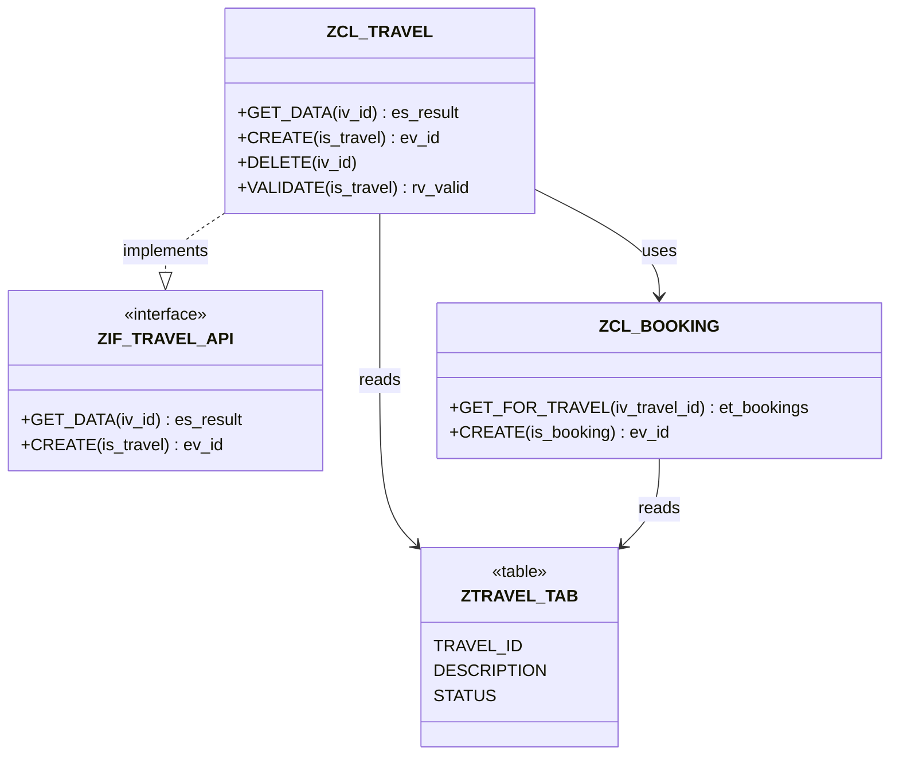

# VSP Roadmap — Detailed Feature Specifications

**Date:** 2026-04-06
**Report ID:** 2026-04-06-004
**Subject:** Detailed spec for each roadmap item, ordered by priority
**Audience:** Implementation handoff for Codex/Claude

---

## 1. Usage Examples MVP

**Priority:** #1 flagship feature
**Effort:** 2-3 days
**Status:** Not started

### User Problem

"How do I call this method/FM/form correctly?" — today requires manually opening each caller in Eclipse, reading source, finding the call site. For popular objects with 50+ callers, this takes hours.

No SAP tool answers: "show me 5 good examples of how this is actually used."

### Input Types (v1)

| Input | CLI Syntax | MCP params |
|-------|-----------|------------|
| Function module | `vsp examples FUNC Z_CALCULATE_TAX` | `object_type: "FUNC", object_name: "Z_CALCULATE_TAX"` |
| Class method | `vsp examples CLAS ZCL_TRAVEL METHOD GET_DATA` | `object_type: "CLAS", object_name: "ZCL_TRAVEL", method: "GET_DATA"` |
| Interface method | `vsp examples INTF ZIF_API METHOD EXECUTE` | `object_type: "INTF", object_name: "ZIF_API", method: "EXECUTE"` |
| SUBMIT program | `vsp examples SUBMIT ZREPORT_PRICING` | `object_type: "SUBMIT", object_name: "ZREPORT_PRICING"` |
| FORM in program | `vsp examples PROG ZREPORT FORM BUILD_OUTPUT` | `object_type: "PROG", object_name: "ZREPORT", form: "BUILD_OUTPUT"` |

Deferred to v1.1: Transaction (needs TSTC → program resolution), BAdI/enhancement patterns.

### MCP Request Shape

```
SAP(action="analyze", params={
  "type": "usage_examples",
  "object_type": "CLAS",
  "object_name": "ZCL_TRAVEL",
  "method": "GET_DATA",
  "max_examples": 10
})
```

### Algorithm

```
Step 1: REVERSE CALLER DISCOVERY
  ├── Try ADT GetCallersOf (best quality, method-level)
  ├── Fallback: WBCROSSGT WHERE NAME LIKE 'target%' (type references)
  └── Fallback: CROSS WHERE NAME LIKE 'target%' (procedural references)
  Result: list of caller includes → NormalizeInclude → object-level callers

Step 2: CALLER RANKING (before source fetch, to cap I/O)
  ├── Test classes first (LCL_TEST*, *_TEST*, testclasses include)
  ├── Same-package callers next
  ├── Custom (Z/Y) callers before standard
  ├── Recently transported callers before stale
  └── Cap at max_examples (default 10)

Step 3: SOURCE FETCH
  For each ranked caller:
  └── GetSource(ctx, objType, objName, nil) — with known type for correct dispatch

Step 4: SNIPPET EXTRACTION (parser-based)
  For each caller source, find call sites matching target:
  ├── CALL FUNCTION 'FM_NAME'        → extract surrounding 3-8 lines
  ├── zcl_class=>method( ... )       → extract surrounding 3-8 lines
  ├── zcl_class->method( ... )       → extract surrounding 3-8 lines
  ├── zif_intf~method( ... )         → extract surrounding 3-8 lines
  ├── PERFORM form IN PROGRAM prog   → extract surrounding 3-8 lines
  ├── SUBMIT prog WITH ...           → extract surrounding 3-8 lines
  └── Fallback: literal string grep for target name → context lines

Step 5: FORMAT AND RETURN
  Per example: caller identity, snippet with line numbers, confidence, source
```

### Output Shape

```
UsageExamplesResult:
  Target:       string          // "CLAS:ZCL_TRAVEL=>GET_DATA"
  TotalCallers: int             // total callers found before cap
  Examples:     []UsageExample

UsageExample:
  CallerID:     string          // "CLAS:ZCL_ORDER_SERVICE"
  CallerName:   string          // "ZCL_ORDER_SERVICE"
  CallerType:   string          // "CLAS"
  CallerMethod: string          // "CREATE_ORDER" (if identifiable)
  Package:      string          // "$ZDEV"
  IsTestClass:  bool            // true if test include / LCL_TEST
  Snippet:      string          // 3-8 lines with line numbers
  LineNumber:   int             // line of the call site
  Confidence:   string          // "HIGH" (parser match) / "MEDIUM" (grep match)
  Source:       string          // "ADT_CALLERS" / "WBCROSSGT" / "CROSS" / "PARSER"
```

### Example CLI Output

```
Usage examples: ZCL_TRAVEL=>GET_DATA (5 of 23 callers)

1. CLAS ZCL_ORDER_SERVICE (method CREATE_ORDER) [$ZDEV] — HIGH
   42 |   DATA(lo_travel) = NEW zcl_travel( ).
   43 |   lo_travel->get_data(
   44 |     EXPORTING iv_id = lv_travel_id
   45 |     IMPORTING es_result = ls_data
   46 |   ).

2. PROG ZTEST_TRAVEL_API (test class) [$TMP] — HIGH
   15 |   cut->get_data( EXPORTING iv_id = '00001' IMPORTING es_result = ls_act ).
   16 |   cl_abap_unit_assert=>assert_not_initial( ls_act ).

3. CLAS ZCL_BOOKING_HELPER (method VALIDATE) [$ZBOOKING] — HIGH
   88 |   DATA(ls_travel) = VALUE #( ).
   89 |   io_travel_api->get_data(
   90 |     EXPORTING iv_id = is_booking-travel_id
   91 |     IMPORTING es_result = ls_travel
   92 |   ).
   93 |   IF ls_travel-status = 'X'.

4. PROG ZREPORT_TRAVEL_EXPORT [$ZDEV] — MEDIUM (grep match)
   112 |   lo_api->get_data( EXPORTING iv_id = <ls_sel>-travel_id
   113 |                     IMPORTING es_result = <ls_out> ).
```

### Ranking Logic

| Priority | Criterion | Reason |
|----------|-----------|--------|
| 1 | Test classes (LCL_TEST, testclasses include) | Cleanest examples, show intended usage patterns |
| 2 | Same package as target | Most likely to show canonical internal usage |
| 3 | Custom code (Z/Y prefix) | Real-world usage over SAP glue code |
| 4 | Recently transported (E070 date) | Active code over stale/abandoned |
| 5 | Standard SAP callers | Less relevant, include only if custom callers < max |

### Data Sources

| Source | What it gives | When used |
|--------|--------------|-----------|
| ADT GetCallersOf | Method-level callers, best precision | Primary, when available |
| WBCROSSGT reverse | Type-level references (who references target) | Fallback for class/interface |
| CROSS reverse | Procedural references (FM calls, SUBMIT) | Fallback for FM/SUBMIT/FORM |
| GetSource | Caller source code for snippet extraction | Always (per selected caller) |
| Parser (ExtractDepsFromSource) | Call site identification within source | Snippet extraction |
| Grep (literal match) | Fallback call site finding | When parser doesn't match |

### Risks

- **Slow:** 10 source fetches × 1-2s = 10-20s. Mitigate: cap callers, rank before fetch.
- **Noisy for popular objects:** BAPI_MATERIAL_GET_DETAIL has 500+ callers. Mitigate: cap at 10, prioritize custom.
- **Snippet quality:** parser may not perfectly identify call site boundaries. Mitigate: grep fallback with context lines. Good enough > perfect.
- **Method disambiguation:** class with overloaded methods or interface redefinitions. Mitigate: match method name in source, accept occasional extra snippets.

### What v1 Does NOT Do

- Perfect parameter block parsing for all ABAP syntax forms
- Deep semantic analysis of parameter types/values
- Call chain visualization (that's impact query's job)
- Automatic test generation from examples (future: "Instant Boilerplate")

### Files to Create/Modify

| File | Action |
|------|--------|
| `pkg/graph/queries_examples.go` | New: UsageExample types, snippet extraction, ranking |
| `pkg/graph/queries_examples_test.go` | New: unit tests for extraction and ranking |
| `internal/mcp/handlers_graph.go` | Edit: add handleUsageExamples, fetchCallers |
| `internal/mcp/handlers_analysis.go` | Edit: add case "usage_examples" |
| `cmd/vsp/cli_extra.go` | Edit: add graphExamplesCmd, runGraphExamples |

---

## 2. VSP Health

**Priority:** #2 quick win
**Effort:** 1 day
**Status:** Not started

### User Problem

"I'm about to touch this legacy package. How bad is it?" — today requires running 4-5 separate tools and mentally aggregating results.

### CLI Syntax

```bash
vsp health $ZDEV
vsp health $ZDEV --format json
vsp health $ZDEV --format html
```

### MCP Request Shape

```
SAP(action="analyze", params={"type": "health", "package": "$ZDEV"})
```

### What It Orchestrates

| Check | Existing Tool | What It Reports |
|-------|--------------|-----------------|
| Object inventory | TADIR query | Count by type (CLAS, PROG, INTF, ...) |
| Unit tests | RunUnitTests (per object) | passed / failed / no tests |
| Code quality | RunATCCheck (package-level) | findings by priority (error/warning/info) |
| Boundary violations | CheckBoundaries | violation count, crossed packages |
| Transport activity | E070/E071 query | last transport date, transport count in 90 days |
| Staleness | E070 AS4DATE | objects not changed in >6 months |

### Output Shape

```
HealthReport:
  Package:         string
  ObjectCount:     int
  ObjectsByType:   map[string]int
  Tests:           TestSummary      // passed, failed, noTests
  ATC:             ATCSummary       // errors, warnings, info
  Boundaries:      BoundarySummary  // violations, crossedPackages
  LastTransport:   string           // YYYYMMDD
  TransportsLast90: int
  StaleObjects:    int              // not changed in >180 days
  Verdict:         string           // "✅ Healthy" / "⚠️ Issues" / "❌ Critical"
```

### Example CLI Output

```
Health Report: $ZDEV (23 objects: 12 CLAS, 8 PROG, 3 INTF)

Tests:        14 passed, 2 failed, 7 no tests
ATC:          3 errors, 12 warnings
Boundaries:   1 violation ($ZHR cross-package dependency)
Last change:  2026-03-28 (8 days ago)
Activity:     12 transports in last 90 days
Stale:        3 objects not touched in 6+ months

Verdict: ⚠️ 2 test failures, 1 boundary violation
```

### Risks

- **Slow for large packages:** 50+ objects × unit tests can take minutes. Mitigate: cap at 30 objects for tests, always do ATC at package level.
- **RunUnitTests failures:** some objects may not have test classes. Report "no tests" not "failed."

### Files to Create/Modify

| File | Action |
|------|--------|
| `internal/mcp/handlers_health.go` | New: handleHealth, orchestration logic |
| `internal/mcp/handlers_analysis.go` | Edit: add case "health" |
| `cmd/vsp/cli_extra.go` | Edit: add healthCmd, runHealth |

---

## 3. Impact Output Polish

**Priority:** #3 small polish
**Effort:** 2-3 hours
**Status:** Not started

### What It Is

Add `--format mermaid` and `--format html` to impact CLI output. Same pattern as already implemented for co-change and where-used-config.

### What's Needed

```go
// pkg/graph/format.go — add:
func ImpactToMermaid(result *ImpactResult) string
```

Visualization:
- Root node highlighted (green)
- BFS layers by depth (color gradient)
- Edge labels: CALLS / REFERENCES / READS_CONFIG
- Depth shown as concentric layers (LR layout)

### CLI Addition

```bash
vsp graph impact CLAS ZCL_FOO --format mermaid > impact.mmd
vsp graph impact CLAS ZCL_FOO --format html > impact.html
```

(Currently impact only exists as MCP. This also adds it as CLI subcommand.)

### Files to Modify

| File | Action |
|------|--------|
| `pkg/graph/format.go` | Edit: add ImpactToMermaid |
| `pkg/graph/format_test.go` | Edit: add test |
| `cmd/vsp/cli_extra.go` | Edit: add graphImpactCmd (new CLI subcommand) |

---

## 4. VSP Changelog

**Priority:** #4 operational win
**Effort:** 1 day
**Status:** Not started

### User Problem

"What changed in this package recently?" — today requires SE10/SE03 or manual TADIR+E070 queries.

### CLI Syntax

```bash
vsp changelog $ZDEV
vsp changelog $ZDEV --since 20260101
vsp changelog $ZDEV --top 20
vsp changelog $ZDEV --format json
```

### MCP Request Shape

```
SAP(action="analyze", params={"type": "changelog", "package": "$ZDEV", "since": "20260101"})
```

### Algorithm

```
1. TADIR WHERE DEVCLASS = package → object list
2. E071 WHERE OBJ_NAME IN (object_names) AND PGMID = 'R3TR' → transport numbers
3. E070 + E07T for those transports → headers + descriptions
4. Group by transport, sort by date descending
5. Format as timeline
```

### Output Shape

```
ChangelogResult:
  Package:      string
  Since:        string              // filter date
  Entries:      []ChangelogEntry

ChangelogEntry:
  Transport:    string              // A4HK900456
  Date:         string              // 2026-04-03
  User:         string              // DEVELOPER
  Description:  string              // "Fix pricing calculation"
  Type:         string              // K=Workbench, W=Customizing
  Objects:      []string            // ["CLAS ZCL_PRICING", "PROG ZREPORT_PRICE"]
```

### Example CLI Output

```
Changelog: $ZDEV (since 2026-01-01)

2026-04-03  A4HK900456  DEVELOPER  "Fix pricing calculation for edge cases"
  CLAS ZCL_PRICING, PROG ZREPORT_PRICE

2026-03-28  A4HK900421  ADMIN      "Add new travel status field"
  CLAS ZCL_TRAVEL, DDLS ZTRAVEL, TABL ZTRAVEL_TAB

2026-03-15  A4HK900398  DEVELOPER  "Refactor order validation"
  CLAS ZCL_ORDER, CLAS ZCL_VALIDATOR, INTF ZIF_VALIDATOR

12 transports, 28 object changes
```

### Note on ZBLAME

Similar to existing ZBLAME program in some SAP systems. Difference: `vsp changelog` is aggregated by transport (not per-line blame), works from CLI without SAP GUI, and outputs structured JSON/mermaid.

### Files to Create/Modify

| File | Action |
|------|--------|
| `internal/mcp/handlers_changelog.go` | New: handleChangelog |
| `internal/mcp/handlers_analysis.go` | Edit: add case "changelog" |
| `cmd/vsp/cli_extra.go` | Edit: add changelogCmd, runChangelog |

---

## 5. Upgrade-Check

**Priority:** #5 enterprise capability
**Effort:** 3 days
**Status:** Not started

### User Problem

"Is this package ready for S/4HANA Cloud?" — today requires running ATC with cloud profile, manually checking each API release state, and cross-referencing simplification items. Hours of work per package.

### CLI Syntax

```bash
vsp upgrade-check $ZDEV
vsp upgrade-check $ZDEV --format html
vsp upgrade-check CLAS ZCL_FOO   # single object
```

### MCP Request Shape

```
SAP(action="analyze", params={"type": "upgrade_check", "package": "$ZDEV"})
```

### Algorithm

```
1. TADIR → object list for package
2. For each source-bearing object:
   a. GetSource → extract all referenced SAP standard objects
   b. For each referenced standard object:
      GetAPIReleaseState → RELEASED / NOT_RELEASED / DEPRECATED
3. RunATCCheck with cloud-readiness variant (if available)
4. Aggregate: released count, not-released count, deprecated count
5. Report with specific replacement recommendations where known
```

### Output Shape

```
UpgradeCheckResult:
  Package:          string
  TotalReferences:  int
  Released:         int
  NotReleased:      int
  Deprecated:       int
  Findings:         []UpgradeFinding
  ATCCloudErrors:   int
  ATCCloudWarnings: int
  Verdict:          string

UpgradeFinding:
  Object:           string       // "CL_GUI_ALV_GRID"
  State:            string       // "NOT_RELEASED" / "DEPRECATED"
  UsedBy:           []string     // ["ZCL_REPORT_VIEW (method DISPLAY)"]
  Replacement:      string       // "CL_SALV_TABLE" (if known)
```

### Example CLI Output

```
S/4HANA Readiness: $ZDEV

API Status:
  ✅ Released:     18 references
  ⚠️ Not released: 5 references
  ❌ Deprecated:   2 references

Issues:
  CL_GUI_ALV_GRID — NOT_RELEASED
    Used by: ZCL_REPORT_VIEW (method DISPLAY)
    Suggested: CL_SALV_TABLE

  POPUP_TO_CONFIRM — NOT_RELEASED
    Used by: ZPROG_UI (line 45)
    Note: No direct cloud replacement, use ADT dialog service

  CALL 'SYSTEM_CALLSTACK' — DEPRECATED
    Used by: ZCL_LOGGER (method GET_CALLER)
    Suggested: CL_ABAP_CALLSTACK

ATC Cloud Profile: 3 errors, 8 warnings

Verdict: ⚠️ 7 items need attention for S/4HANA Cloud
```

### Data Sources

| Source | What it gives |
|--------|--------------|
| GetAPIReleaseState | Release status per object URI (already implemented) |
| RunATCCheck | Cloud-readiness ATC findings |
| Parser (ExtractDepsFromSource) | Referenced standard objects from source |
| Bundled knowledge | Known replacements for common deprecated APIs (static map) |

### Files to Create/Modify

| File | Action |
|------|--------|
| `internal/mcp/handlers_upgrade.go` | New: handleUpgradeCheck |
| `internal/mcp/handlers_analysis.go` | Edit: add case "upgrade_check" |
| `cmd/vsp/cli_extra.go` | Edit: add upgradeCheckCmd |
| `pkg/graph/upgrade_knowledge.go` | New: static map of known API replacements (optional, can start empty) |

---

## 6. VSP Sketch

**Priority:** #6 architecture visualization
**Effort:** 3 days
**Status:** Not started

### User Problem

"Show me the architecture of this package" — today requires manually drawing diagrams from code. No automated SAP→diagram pipeline exists.

### CLI Syntax

```bash
vsp sketch $ZDEV --format mermaid
vsp sketch $ZDEV --format html
vsp sketch CLAS ZCL_TRAVEL --format mermaid  # single class with deps
```

### MCP Request Shape

```
SAP(action="analyze", params={"type": "sketch", "package": "$ZDEV"})
```

### Algorithm

```
1. TADIR → objects in package
2. For classes/interfaces: GetObjectStructure → methods, attributes, interfaces
3. WBCROSSGT/CROSS → dependencies between package objects
4. Detect: inheritance (INHERITING FROM), interface implementation (INTERFACES)
5. Generate Mermaid classDiagram with:
   - Classes as nodes (public methods listed)
   - Interfaces with <<interface>> stereotype
   - Implementation edges (dotted arrow)
   - Inheritance edges (solid triangle arrow)
   - Usage edges (dependency arrows)
   - Package grouping as subgraphs (if cross-package deps shown)
```

### Example Mermaid Output



### Data Sources

| Source | What it gives |
|--------|--------------|
| TADIR | Object list for package |
| GetObjectStructure | Methods, attributes, interfaces per class |
| WBCROSSGT/CROSS | Inter-object dependencies |
| Parser (on source) | INHERITING FROM, INTERFACES declarations |

### Risks

- **Large packages:** 50+ classes → unreadable diagram. Mitigate: cap at 20 most-connected objects, or allow `--focus CLAS ZCL_FOO` to show ego-network.
- **Method extraction:** GetObjectStructure may not be available on all systems. Fallback: show class nodes without method detail.

### Files to Create/Modify

| File | Action |
|------|--------|
| `pkg/graph/format_sketch.go` | New: SketchToMermaid (classDiagram format) |
| `internal/mcp/handlers_sketch.go` | New: handleSketch, structure fetch |
| `internal/mcp/handlers_analysis.go` | Edit: add case "sketch" |
| `cmd/vsp/cli_extra.go` | Edit: add sketchCmd, runSketch |
